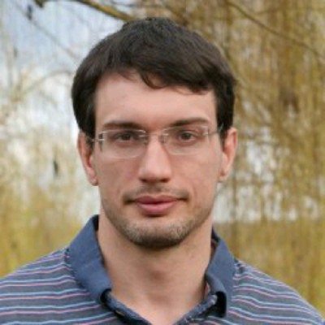

Humans rely on **stereo vision** and **motion parallax** to estimate depth in their near surroundings. 
However, these cues become weaker as depth increases. 
As a result, humans rely profoundly on **monocular cues** when estimating depth in the far range.

Depth estimation is one of the central challenges of **monocular 3D reconstruction**. 
Computer vision algorithms for 3D reconstruction from monocular images have advanced substantially over the past few years. 
However, depth estimation in the far range still suffers from **poor accuracy**. 
This can be partly attributed to the **insufficient cues** used by current approaches. 
Moreover, the benchmarking procedure for these algorithms has remained largely unchanged relying on **simple metrics** and **sparse LiDAR** data. 
This prevents insights into the performance of each method, especially where the ground-truth is incorrect.

This tutorial will serve as an introduction to the field of **monocular 3D reconstruction**, discussing both fundamental approaches and recent State-of-the-Art. 
The focus will be on various approaches to depth estimation, from the use of **graphs** to implicitly reason about depth, to more **explicit representations**. 
Additionally, a core component of the tutorial will be centred on a novel Monocular Depth Estimation (MDE) **benchmarking procedure**. 
This will cover important topics such as training different baselines in a fair and comparable manner, the selection of metrics and a **new evaluation dataset** containing a variety of complex urban and natural scenes.

---

## :open_book: **Slides** {#slides}

> Each talk contains additional videos and explanations that complement the slides.
> 
> Please check out the [recordings](#videos) for the full experience!

- [**Introduction to MDE**](./assets/slides/Introduction_MDE.pdf) -- Jaime Spencer 
- [**Benchmarking MDE: The Design Decisions that Matter**](./assets/slides/Benchmarking_MDE.pdf) -- Jaime Spencer 
- [**Introduction to BEV Mapping**](./assets/slides/Introduction_BEV.pdf) -- Avishkar Saha 
- [**Addressing the shortcomings of BEV Mapping**](./assets/slides/Shortcomings_BEV.pdf) -- Avishkar Saha 

---

## :camera: **Videos** {#videos}

> Videos will be released soon!

---

## :construction_worker: **Organizers** {#organizers}

<figure>
    
    <b> <a href="https://www.surrey.ac.uk/people/jaime-spencer-martin">Jaime Spencer</a>
     Research Fellow  University of Surrey</b>
</figure>

<figure>
    
    <b> <a href="https://www.surrey.ac.uk/people/avishkar-saha">Avishkar Saha</a>
     PhD Student  University of Surrey</b>
</figure>

<figure>
    
    <b> <a href="https://www.amazon.science/author/chris-russell?0000016e-4318-de2e-a76e-cfdfa9700000-page=2">Chris Russell</a>
     Senior Applied Scientist  Amazon</b>
</figure>

<figure>
    
    <b> <a href="http://personal.ee.surrey.ac.uk/Personal/S.Hadfield/biography.html">Simon Hadfield</a>
     Senior Lecturer  University of Surrey</b>
</figure>

<figure>
    
    <b> <a href="http://personal.ee.surrey.ac.uk/Personal/R.Bowden/">Richard Bowden</a>
     Professor  University of Surrey</b>
</figure>

